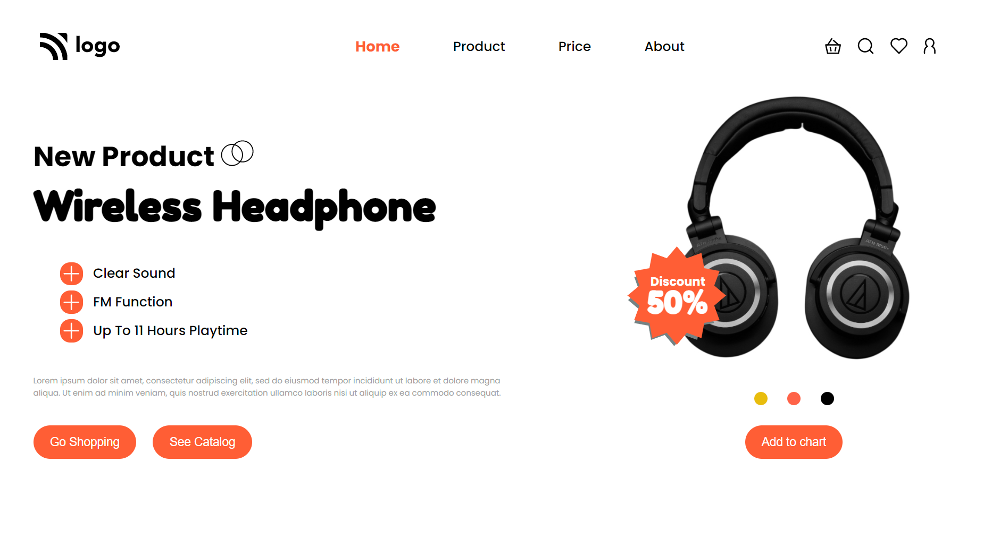

# Project -7 

## Project Title - Product Homepage
This is the landing page of product Homepage.

##  Time to complete this project :-

## What I have Learned in this Project :-

- Layout Making Using - **Flexbox**.
- How to use - **Fonts** in Css.
- Make - **Beautiful Buttons**.
- How to Use of - **Badges**.

## Technology Used :-

Project  built from using

 
&

[Click Me](https://regal-cranachan-c8143b.netlify.app) to see the project Demo.

## Screenshot of  project :-

## Features :-

- Live previews
- Fullscreen mode
- Mobile responsive
- Tablet responsive

## 🔗 Links

